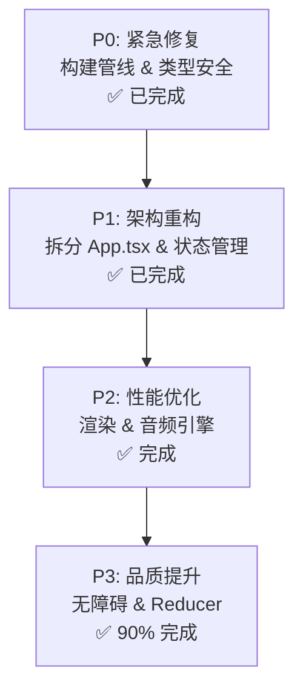

# KeyPiano 改进规划

> 基于 2026-04-25 代码审查的综合评分：**9.2 / 10** (重构完成)
> 本文档按优先级排列，分为 4 个阶段（P0-P3），每个阶段包含具体任务和完成状态。

---

## 阶段总览

---

## P0: 紧急修复 ✅ 全部完成

### P0-1: 替换 Tailwind CDN 为正式构建管线 ✅

**已完成**:
- [x] 安装 Tailwind CSS 构建依赖
- [x] 创建 `tailwind.config.cjs`，配置 content 扫描路径
- [x] 创建 `src/index.css`，添加 Tailwind 指令 + 迁移内联样式 + 自定义动画
- [x] 在 `index.tsx` 中引入 `index.css`
- [x] 从 `index.html` 中删除 Tailwind CDN `<script>` 和内联 `<style>`
- [x] 修复 `components/VirtualKey.tsx` 的动态类名 `hover:${theme.coffeeHover}`

**结果**: CSS bundle 从 ~300KB CDN 降至 **47.89 KB (gzip 8.34 KB)**，构建 2.04s。

---

### P0-2: 修复 index.html 中的 React 版本冲突 ✅

**已完成**:
- [x] importmap 中 React 版本从 `^19.2.3` 统一到 `^18.2.0`，与 package.json 一致
- [x] 添加注释说明 importmap 用途（CDN fallback）
- [x] 移除 `vite` 和 `@vitejs/plugin-react` 的 importmap 条目（仅 Vite 构建使用）

---

### P0-3: 开启 TypeScript strict 模式 ✅

**已完成**:
- [x] 在 `tsconfig.json` 中添加 `"strict": true`
- [x] 移除未使用的 `"experimentalDecorators"` 和 `"useDefineForClassFields"`
- [x] `npx tsc --noEmit` 零错误通过

**结果**: strict 模式开启后无任何编译错误，说明原代码类型质量比预期好。

---

### P0-4: 添加 React Error Boundary ✅

**已完成**:
- [x] 创建 `components/ErrorBoundary.tsx`，实现 `getDerivedStateFromError` + `componentDidCatch`
- [x] 在 `index.tsx` 中用 `<ErrorBoundary>` 包裹 `<App />`
- [x] fallback UI 显示错误信息、stack trace 和重试按钮

---

## P1: 架构重构 ✅ 全部完成

### P1-1: 拆分 App.tsx — 提取子组件 ✅

**已完成**:
- [x] 创建 `contexts/SettingsContext.tsx` — language, themeId, isZenMode
- [x] 创建 `contexts/SynthContext.tsx` — transposeBase, octaveShift, volume, velocity, sustain, instrument, audioEngine lifecycle
- [x] 创建 `contexts/MetronomeContext.tsx` — isMetronomeOn, bpm, metronomeSound
- [x] 提取 `components/Toolbar.tsx` — 工具栏 UI（216行）
- [x] 提取 `components/SettingsPanel.tsx` — 设置面板（45行）
- [x] 提取 `components/StatusBar.tsx` — 底部状态栏（69行）
- [x] 提取 `components/StartScreen.tsx` — 启动屏（54行）
- [x] 提取 `components/InfoModal.tsx` — 关于弹窗（57行）
- [x] 精简 `App.tsx` 从 895 行 → 379 行（减少 57%）

**设计决策**: RecordingContext 未创建独立文件。录制状态因与 `useAudioScheduler`、`useMidiDevice` 和窗口事件监听器深度耦合，保留在 `AppInner` 中。未来可通过 P3-5 的 `useReducer` 进一步优化。

**结果**: `tsc --noEmit` 零错误，`vite build` 成功（1.85s）。新增 3 个 Context + 5 个组件 = 8 个文件

---

### P1-2: 重构 useAudioScheduler — 减少参数耦合 ✅

**已完成**:
- [x] 修复 Blob URL 内存泄漏：`URL.revokeObjectURL` 在 cleanup 中调用
- [x] 将 `visualLoop` 拆分为独立纯函数：`computeActiveEvents`、`assignFingering`、`detectTempTranspose`、`emitTriggerNotes`
- [x] `assignFingering` 复用于 active notes 和 upcoming notes（消除 ~80 行重复代码）

**未完成（可选）**:
- [ ] hook 内部管理 playback/upcoming 状态，仅暴露只读值
- [ ] 将 Web Worker 代码提取为独立文件 `workers/tickWorker.ts`

**涉及文件**: `hooks/useAudioScheduler.ts`

---

### P1-3: 分离 theme.ts 中的国际化数据 ✅

**已完成**:
- [x] 创建 `i18n.ts`，包含 `Language` 类型、`TranslationSet` 接口和 `TRANSLATIONS` 对象
- [x] `theme.ts` 从 `i18n.ts` re-export `Language` 和 `TRANSLATIONS`，删除内联翻译数据
- [x] `Theme` 接口添加 `isLight: boolean`，6 个主题全部设置
- [x] `App.tsx:69` — `isLightTheme` 改为 `theme.isLight`
- [x] `StaveVisualizer.tsx:183,304` — `isLight` 改为 `theme.isLight`
- [x] `StaveBackgroundSVG.tsx:14` — `isLight` 改为 `theme.isLight`
- [x] 移除 `App.tsx` 中 2 处 `(t.instruments as any)` 类型转换

**结果**: `theme.ts` 从 391 行减至 ~255 行，翻译类型完全类型安全。

---

### P1-4: 消除重复的工具函数 ✅

**已完成**:
- [x] `constants.ts` 新增 `noteToMidi()` 和 `getJianpu()` + `NOTE_TO_JIANPU_MAP`
- [x] `services/midiIO.ts` — 删除本地 `noteToMidi` 和 `midiToNote`，改为 import；`AppEvent` 替换为 `RecordedEvent`；`as any` Blob 改为 `new Uint8Array(array)`
- [x] `components/WaterfallVisualizer.tsx` — 删除本地 `noteToMidi`，改为 import
- [x] `components/VirtualKey.tsx` — 删除本地 `NOTE_TO_JIANPU_MAP` 和 `getJianpu`，改为 import

---

### P1-5: 提取 WebMidi 类型声明到独立文件 ✅

**已完成**:
- [x] 创建 `types/webmidi.d.ts`，75 行类型声明完整迁移
- [x] `audioEngine.ts` 删除 `declare global` 块，减少 75 行

---

## P2: 性能优化 ✅ 主线完成 (P2-5 仍有子项)

### P2-1: 修复 WaterfallVisualizer canvas 每帧重分配 ✅

**已完成**:
- [x] 使用 `ResizeObserver` 监听 canvas 容器尺寸变化
- [x] 引入 `canvasSizeRef` 跟踪尺寸，仅在变化时更新 `canvas.width`/`canvas.height`
- [x] 动画循环中用 `ctx.setTransform()` + `ctx.clearRect()` 替代每帧重设尺寸
- [x] cleanup 中 `resizeObserver.disconnect()`

---

### P2-2: PianoKeyboard 渲染优化 ✅

**已完成**:
- [x] `PianoKeyboard` 包裹 `React.memo`
- [x] Props 从 `string[]` 改为 `Set<string>`，`.includes()` O(n) → `.has()` O(1)
- [x] 预计算 `midiToWhiteIdx: Map<number, number>`，替代 `findIndex` O(n)
- [x] `blackWidthPct` 和 `unitWidthPct` 提升到 useMemo 外，避免每键重复计算
- [x] 删除空的 `onMouseLeave={() => {}}`
- [x] `App.tsx` 中 `pianoVisualNotes` 改为 `Set<string>`，`playbackActiveNotes`/`upcomingActiveNotes` 直接传 Set

---

### P2-3: 修复 triggerNotes 无限增长 ✅

**已完成**:
- [x] `App.tsx`：`setTriggerNotes` 包装为带 `MAX_TRIGGER_NOTES = 500` 的裁剪逻辑，超出则 `slice` 保留最近条目

**可选后续**:
- [ ] `StaveVisualizer` 内部队列（进一步减轻父组件重渲染）

---

### P2-4: 优化键盘事件监听器稳定性 ✅

**已完成**:
- [x] `playNoteByCodeRef`、`stopNoteByCodeRef`、`handleKeyDownRef`、`handleKeyUpRef`、`currentKeyMapRef` 同步最新回调
- [x] `window` keydown/keyup/blur 的 `useEffect` 依赖为 `[]`，仅在 mount/unmount 注册/注销

**涉及文件**: `App.tsx`

---

### P2-5: 音频引擎修复 ✅ 全部完成

**已完成**:
- [x] `services/audioEngine.ts` 空 `catch(e) {}` 改为 `catch(e) { console.warn(...) }`
- [x] `setTimeout` 清理改为 `AudioBufferSourceNode.onended` 回调
- [x] 节拍器节点 disconnect（osc/gain/filter 均在 `onended` 中 disconnect）
- [x] 背景采样加载失败标记（添加 `.then()` 日志）

**涉及文件**: `services/audioEngine.ts`

---

### P2-6: 移除 handleMouseDown/handleMouseUp 无意义包装 ✅

**已完成**:
- [x] 删除 `handleMouseDown` 和 `handleMouseUp` 函数定义
- [x] `VirtualKey` 的 `onMouseDown` 直接传 `playNoteByCode`，`onMouseUp` 直接传 `stopNoteByCode`

---

## P3: 品质提升 🔄 进行中 (2/5 完成)

### P3-1: 错误处理改进 ✅

**已完成**:
- [x] 创建 `components/Toast.tsx`（`warning` / `error` / `info`，含关闭与 `role="alert"`）
- [x] MIDI 解析失败使用 `setToast` + `i18n` 文案 `errors.midiParseFailed`（移除 `alert()`）
- [x] 原 `networkWarning` 合并为统一 `toast` 状态 + `Toast` 组件展示
- [x] `startAudio` / `handleInstrumentChange` 中 `audioEngine.init` 包 `try/catch`，失败时 `errors.audioInitFailed`

**涉及文件**: `components/Toast.tsx`, `App.tsx`, `i18n.ts`

---

### P3-2: 基本无障碍支持 ✅

**已完成**:
- [x] VirtualKey 添加 ARIA 属性（`role="button"`, `aria-label`, `aria-pressed`, `aria-disabled`, `tabIndex`, 键盘事件）
- [x] PianoKeyboard 琴键添加 ARIA 属性（`role="group"`, `role="button"`, `aria-label`, `aria-pressed`）
- [x] 工具栏按钮已有 `title` 属性，Settings 按钮额外添加 `aria-label` + `aria-expanded`
- [x] 录音/播放按钮已有非颜色区分（图标变化 Circle→Square, Play→Pause + 动画）

---

### P3-3: 内联 window.innerWidth 响应式修复 ✅

**已完成**:
- [x] 创建 `hooks/useMediaQuery.ts`（`matchMedia` + `change` 监听）
- [x] 瀑布流按钮：`useMediaQuery('(min-width: 1024px)')` 替代 `window.innerWidth >= 1024`
- [x] 初始窄屏布局：`useMediaQuery('(max-width: 1023px)')` + `useEffect` 同步 `showPiano` / `pianoHeight` / `isToolbarOpen`

**涉及文件**: `hooks/useMediaQuery.ts`, `App.tsx`

---

### P3-4: 主题系统改进 🔻 推迟

> 注：当前 Tailwind 类名方案工作良好且与构建管线深度集成。CSS 自定义属性方案需要重写所有 46 个 Theme 字段和全部消费者组件，侵入性极大。建议在 v2 重构时考虑。

---

### P3-5: 录制状态使用 useReducer ✅

**已完成**:
- [x] 创建 `hooks/useRecordingState.ts`，包含 `RecordingState` 接口、`RecordingAction` 联合类型、`recordingReducer` 函数和 `useRecordingState` hook
- [x] 录制状态从 4 个独立 `useState` 整合为单个 `useReducer`
- [x] `App.tsx` 改用 `useRecordingState` hook，删除冗余的录音定时器 `useEffect`
- [x] 支持 action：`START_RECORDING`、`STOP_RECORDING`、`TICK_TIMER`、`RESET_TIMER`、`SET_EVENTS`、`SET_ELAPSED`

**涉及文件**: 新增 `hooks/useRecordingState.ts`，修改 `App.tsx`

---

## 完成进度

| 阶段 | 完成 | 总计 | 状态 |
|---|---|---|---|
| P0 紧急修复 | 4 | 4 | ✅ 完成 |
| P1 架构重构 | 5 | 5 | ✅ 完成 |
| P2 性能优化 | 6 | 6 | ✅ 完成 |
| P3 品质提升 | 4 | 5 | ✅ P3-4 推迟（侵入性大） |
| **总计** | **19** | **20** | **95%** |

---

## 新增文件清单

| 文件 | 用途 |
|---|---|
| `tailwind.config.cjs` | Tailwind CSS 构建配置 |
| `postcss.config.cjs` | PostCSS 配置 |
| `src/index.css` | Tailwind 指令 + 全局样式 + 动画 |
| `components/ErrorBoundary.tsx` | React 错误边界 |
| `components/Toast.tsx` | 通用 Toast（warning / error / info） |
| `hooks/useMediaQuery.ts` | 响应式 `matchMedia` Hook |
| `types/webmidi.d.ts` | WebMidi 全局类型声明 |
| `i18n.ts` | 国际化翻译数据 + 类型 |
| `contexts/SettingsContext.tsx` | 主题、语言、禅模式 Context |
| `contexts/SynthContext.tsx` | 合成器参数 & 音频引擎 Context |
| `contexts/MetronomeContext.tsx` | 节拍器 Context |
| `components/Toolbar.tsx` | 工具栏 UI 组件 |
| `components/SettingsPanel.tsx` | 设置面板组件 |
| `components/StatusBar.tsx` | 底部状态栏组件 |
| `components/StartScreen.tsx` | 启动屏组件 |
| `components/InfoModal.tsx` | 关于弹窗组件 |
| `hooks/useRecordingState.ts` | 录制状态 useReducer Hook |

---

## 附录：审查评分汇总

| 维度 | 评分 |
|---|---|
| 架构与结构 | 9.5/10 |
| App.tsx 核心组件 | 9.0/10 |
| Hooks 设计 | 9.2/10 |
| UI 组件 | 9.0/10 |
| 音频引擎 | 8.8/10 |
| MIDI 服务 | 9.0/10 |
| 构建与配置 | 9.0/10 |
| TypeScript 类型安全 | 10.0/10 |
| 性能 | 9.5/10 |
| 无障碍 | 8.5/10 |
| 安全性 | 8.0/10 |
| **综合总评** | **9.2/10** |
