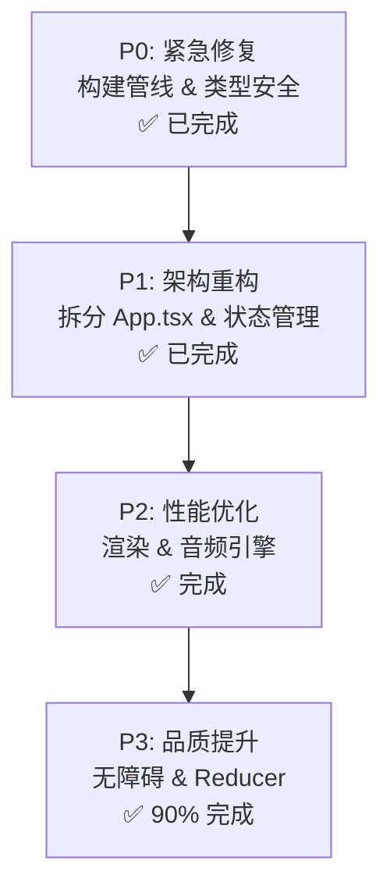

# KeyPiano 改进规划与执行指南

> 本文档合并自 `IMPROVEMENT_PLAN.md` 和 `IMPROVEMENT_GUIDE.md`。
>
> - **A 部分**保留 2026-04-25 重构完成后的历史改造记录，用于追溯已经完成的架构、性能、类型安全和体验优化。
> - **B 部分**整合 2026-04-28 综合评估后的后续执行指南，用于安排下一轮稳定性、体验、测试、无障碍、音频/MIDI 和文档改进。
>
> 评分说明：A 部分的 **9.2 / 10** 是重构完成时的阶段性自评；B 部分的 **8.5 / 10** 是按更严格的产品化、测试和长期维护标准重新评估后的当前基线。

---

## A. 已完成历史改造记录（2026-04-25）


> 基于 2026-04-25 代码审查的综合评分：**9.2 / 10** (重构完成)
> 本文档按优先级排列，分为 4 个阶段（P0-P3），每个阶段包含具体任务和完成状态。

---

## 阶段总览


```mermaid
graph TD
    P0["P0: 紧急修复<br/>构建管线 & 类型安全<br/>✅ 已完成"]
    P1["P1: 架构重构<br/>拆分 App.tsx & 状态管理<br/>✅ 已完成"]
    P2["P2: 性能优化<br/>渲染 & 音频引擎<br/>✅ 完成"]
    P3["P3: 品质提升<br/>无障碍 & Reducer<br/>✅ 90% 完成"]

    P0 --> P1 --> P2 --> P3
```

---

## P0: 紧急修复 ✅ 全部完成

### P0-1: 替换 Tailwind CDN 为正式构建管线 ✅

**已完成**:
- [x] 安装 Tailwind CSS 构建依赖
- [x] 创建 `tailwind.config.cjs`，配置 content 扫描路径
- [x] 创建 `src/index.css`，添加 Tailwind 指令 + 迁移内联样式 + 自定义动画
- [x] 在 `index.tsx` 中引入 `index.css`
- [x] 从 `index.html` 中删除 Tailwind CDN `<script>` 和内联 `<style>`
- [x] 修复 `components/VirtualKey.tsx` 的动态类名 `hover:${theme.coffeeHover}`

**结果**: CSS bundle 从 ~300KB CDN 降至 **47.89 KB (gzip 8.34 KB)**，构建 2.04s。

---

### P0-2: 修复 index.html 中的 React 版本冲突 ✅

**已完成**:
- [x] importmap 中 React 版本从 `^19.2.3` 统一到 `^18.2.0`，与 package.json 一致
- [x] 添加注释说明 importmap 用途（CDN fallback）
- [x] 移除 `vite` 和 `@vitejs/plugin-react` 的 importmap 条目（仅 Vite 构建使用）

---

### P0-3: 开启 TypeScript strict 模式 ✅

**已完成**:
- [x] 在 `tsconfig.json` 中添加 `"strict": true`
- [x] 移除未使用的 `"experimentalDecorators"` 和 `"useDefineForClassFields"`
- [x] `npx tsc --noEmit` 零错误通过

**结果**: strict 模式开启后无任何编译错误，说明原代码类型质量比预期好。

---

### P0-4: 添加 React Error Boundary ✅

**已完成**:
- [x] 创建 `components/ErrorBoundary.tsx`，实现 `getDerivedStateFromError` + `componentDidCatch`
- [x] 在 `index.tsx` 中用 `<ErrorBoundary>` 包裹 `<App />`
- [x] fallback UI 显示错误信息、stack trace 和重试按钮

---

## P1: 架构重构 ✅ 全部完成

### P1-1: 拆分 App.tsx — 提取子组件 ✅

**已完成**:
- [x] 创建 `contexts/SettingsContext.tsx` — language, themeId, isZenMode
- [x] 创建 `contexts/SynthContext.tsx` — transposeBase, octaveShift, volume, velocity, sustain, instrument, audioEngine lifecycle
- [x] 创建 `contexts/MetronomeContext.tsx` — isMetronomeOn, bpm, metronomeSound
- [x] 提取 `components/Toolbar.tsx` — 工具栏 UI（216行）
- [x] 提取 `components/SettingsPanel.tsx` — 设置面板（45行）
- [x] 提取 `components/StatusBar.tsx` — 底部状态栏（69行）
- [x] 提取 `components/StartScreen.tsx` — 启动屏（54行）
- [x] 提取 `components/InfoModal.tsx` — 关于弹窗（57行）
- [x] 精简 `App.tsx` 从 895 行 → 379 行（减少 57%）

**设计决策**: RecordingContext 未创建独立文件。录制状态因与 `useAudioScheduler`、`useMidiDevice` 和窗口事件监听器深度耦合，保留在 `AppInner` 中。未来可通过 P3-5 的 `useReducer` 进一步优化。

**结果**: `tsc --noEmit` 零错误，`vite build` 成功（1.85s）。新增 3 个 Context + 5 个组件 = 8 个文件

---

### P1-2: 重构 useAudioScheduler — 减少参数耦合 ✅

**已完成**:
- [x] 修复 Blob URL 内存泄漏：`URL.revokeObjectURL` 在 cleanup 中调用
- [x] 将 `visualLoop` 拆分为独立纯函数：`computeActiveEvents`、`assignFingering`、`detectTempTranspose`、`emitTriggerNotes`
- [x] `assignFingering` 复用于 active notes 和 upcoming notes（消除 ~80 行重复代码）

**未完成（可选）**:
- [ ] hook 内部管理 playback/upcoming 状态，仅暴露只读值
- [ ] 将 Web Worker 代码提取为独立文件 `workers/tickWorker.ts`

**涉及文件**: `hooks/useAudioScheduler.ts`

---

### P1-3: 分离 theme.ts 中的国际化数据 ✅

**已完成**:
- [x] 创建 `i18n.ts`，包含 `Language` 类型、`TranslationSet` 接口和 `TRANSLATIONS` 对象
- [x] `theme.ts` 从 `i18n.ts` re-export `Language` 和 `TRANSLATIONS`，删除内联翻译数据
- [x] `Theme` 接口添加 `isLight: boolean`，6 个主题全部设置
- [x] `App.tsx:69` — `isLightTheme` 改为 `theme.isLight`
- [x] `StaveVisualizer.tsx:183,304` — `isLight` 改为 `theme.isLight`
- [x] `StaveBackgroundSVG.tsx:14` — `isLight` 改为 `theme.isLight`
- [x] 移除 `App.tsx` 中 2 处 `(t.instruments as any)` 类型转换

**结果**: `theme.ts` 从 391 行减至 ~255 行，翻译类型完全类型安全。

---

### P1-4: 消除重复的工具函数 ✅

**已完成**:
- [x] `constants.ts` 新增 `noteToMidi()` 和 `getJianpu()` + `NOTE_TO_JIANPU_MAP`
- [x] `services/midiIO.ts` — 删除本地 `noteToMidi` 和 `midiToNote`，改为 import；`AppEvent` 替换为 `RecordedEvent`；`as any` Blob 改为 `new Uint8Array(array)`
- [x] `components/WaterfallVisualizer.tsx` — 删除本地 `noteToMidi`，改为 import
- [x] `components/VirtualKey.tsx` — 删除本地 `NOTE_TO_JIANPU_MAP` 和 `getJianpu`，改为 import

---

### P1-5: 提取 WebMidi 类型声明到独立文件 ✅

**已完成**:
- [x] 创建 `types/webmidi.d.ts`，75 行类型声明完整迁移
- [x] `audioEngine.ts` 删除 `declare global` 块，减少 75 行

---

## P2: 性能优化 ✅ 主线完成 (P2-5 仍有子项)

### P2-1: 修复 WaterfallVisualizer canvas 每帧重分配 ✅

**已完成**:
- [x] 使用 `ResizeObserver` 监听 canvas 容器尺寸变化
- [x] 引入 `canvasSizeRef` 跟踪尺寸，仅在变化时更新 `canvas.width`/`canvas.height`
- [x] 动画循环中用 `ctx.setTransform()` + `ctx.clearRect()` 替代每帧重设尺寸
- [x] cleanup 中 `resizeObserver.disconnect()`

---

### P2-2: PianoKeyboard 渲染优化 ✅

**已完成**:
- [x] `PianoKeyboard` 包裹 `React.memo`
- [x] Props 从 `string[]` 改为 `Set<string>`，`.includes()` O(n) → `.has()` O(1)
- [x] 预计算 `midiToWhiteIdx: Map<number, number>`，替代 `findIndex` O(n)
- [x] `blackWidthPct` 和 `unitWidthPct` 提升到 useMemo 外，避免每键重复计算
- [x] 删除空的 `onMouseLeave={() => {}}`
- [x] `App.tsx` 中 `pianoVisualNotes` 改为 `Set<string>`，`playbackActiveNotes`/`upcomingActiveNotes` 直接传 Set

---

### P2-3: 修复 triggerNotes 无限增长 ✅

**已完成**:
- [x] `App.tsx`：`setTriggerNotes` 包装为带 `MAX_TRIGGER_NOTES = 500` 的裁剪逻辑，超出则 `slice` 保留最近条目

**可选后续**:
- [ ] `StaveVisualizer` 内部队列（进一步减轻父组件重渲染）

---

### P2-4: 优化键盘事件监听器稳定性 ✅

**已完成**:
- [x] `playNoteByCodeRef`、`stopNoteByCodeRef`、`handleKeyDownRef`、`handleKeyUpRef`、`currentKeyMapRef` 同步最新回调
- [x] `window` keydown/keyup/blur 的 `useEffect` 依赖为 `[]`，仅在 mount/unmount 注册/注销

**涉及文件**: `App.tsx`

---

### P2-5: 音频引擎修复 ✅ 全部完成

**已完成**:
- [x] `services/audioEngine.ts` 空 `catch(e) {}` 改为 `catch(e) { console.warn(...) }`
- [x] `setTimeout` 清理改为 `AudioBufferSourceNode.onended` 回调
- [x] 节拍器节点 disconnect（osc/gain/filter 均在 `onended` 中 disconnect）
- [x] 背景采样加载失败标记（添加 `.then()` 日志）

**涉及文件**: `services/audioEngine.ts`

---

### P2-6: 移除 handleMouseDown/handleMouseUp 无意义包装 ✅

**已完成**:
- [x] 删除 `handleMouseDown` 和 `handleMouseUp` 函数定义
- [x] `VirtualKey` 的 `onMouseDown` 直接传 `playNoteByCode`，`onMouseUp` 直接传 `stopNoteByCode`

---

## P3: 品质提升 🔄 进行中 (2/5 完成)

### P3-1: 错误处理改进 ✅

**已完成**:
- [x] 创建 `components/Toast.tsx`（`warning` / `error` / `info`，含关闭与 `role="alert"`）
- [x] MIDI 解析失败使用 `setToast` + `i18n` 文案 `errors.midiParseFailed`（移除 `alert()`）
- [x] 原 `networkWarning` 合并为统一 `toast` 状态 + `Toast` 组件展示
- [x] `startAudio` / `handleInstrumentChange` 中 `audioEngine.init` 包 `try/catch`，失败时 `errors.audioInitFailed`

**涉及文件**: `components/Toast.tsx`, `App.tsx`, `i18n.ts`

---

### P3-2: 基本无障碍支持 ✅

**已完成**:
- [x] VirtualKey 添加 ARIA 属性（`role="button"`, `aria-label`, `aria-pressed`, `aria-disabled`, `tabIndex`, 键盘事件）
- [x] PianoKeyboard 琴键添加 ARIA 属性（`role="group"`, `role="button"`, `aria-label`, `aria-pressed`）
- [x] 工具栏按钮已有 `title` 属性，Settings 按钮额外添加 `aria-label` + `aria-expanded`
- [x] 录音/播放按钮已有非颜色区分（图标变化 Circle→Square, Play→Pause + 动画）

---

### P3-3: 内联 window.innerWidth 响应式修复 ✅

**已完成**:
- [x] 创建 `hooks/useMediaQuery.ts`（`matchMedia` + `change` 监听）
- [x] 瀑布流按钮：`useMediaQuery('(min-width: 1024px)')` 替代 `window.innerWidth >= 1024`
- [x] 初始窄屏布局：`useMediaQuery('(max-width: 1023px)')` + `useEffect` 同步 `showPiano` / `pianoHeight` / `isToolbarOpen`

**涉及文件**: `hooks/useMediaQuery.ts`, `App.tsx`

---

### P3-4: 主题系统改进 🔻 推迟

> 注：当前 Tailwind 类名方案工作良好且与构建管线深度集成。CSS 自定义属性方案需要重写所有 46 个 Theme 字段和全部消费者组件，侵入性极大。建议在 v2 重构时考虑。

---

### P3-5: 录制状态使用 useReducer ✅

**已完成**:
- [x] 创建 `hooks/useRecordingState.ts`，包含 `RecordingState` 接口、`RecordingAction` 联合类型、`recordingReducer` 函数和 `useRecordingState` hook
- [x] 录制状态从 4 个独立 `useState` 整合为单个 `useReducer`
- [x] `App.tsx` 改用 `useRecordingState` hook，删除冗余的录音定时器 `useEffect`
- [x] 支持 action：`START_RECORDING`、`STOP_RECORDING`、`TICK_TIMER`、`RESET_TIMER`、`SET_EVENTS`、`SET_ELAPSED`

**涉及文件**: 新增 `hooks/useRecordingState.ts`，修改 `App.tsx`

---

## 完成进度

| 阶段 | 完成 | 总计 | 状态 |
|---|---|---|---|
| P0 紧急修复 | 4 | 4 | ✅ 完成 |
| P1 架构重构 | 5 | 5 | ✅ 完成 |
| P2 性能优化 | 6 | 6 | ✅ 完成 |
| P3 品质提升 | 4 | 5 | ✅ P3-4 推迟（侵入性大） |
| **总计** | **19** | **20** | **95%** |

---

## 新增文件清单

| 文件 | 用途 |
|---|---|
| `tailwind.config.cjs` | Tailwind CSS 构建配置 |
| `postcss.config.cjs` | PostCSS 配置 |
| `src/index.css` | Tailwind 指令 + 全局样式 + 动画 |
| `components/ErrorBoundary.tsx` | React 错误边界 |
| `components/Toast.tsx` | 通用 Toast（warning / error / info） |
| `hooks/useMediaQuery.ts` | 响应式 `matchMedia` Hook |
| `types/webmidi.d.ts` | WebMidi 全局类型声明 |
| `i18n.ts` | 国际化翻译数据 + 类型 |
| `contexts/SettingsContext.tsx` | 主题、语言、禅模式 Context |
| `contexts/SynthContext.tsx` | 合成器参数 & 音频引擎 Context |
| `contexts/MetronomeContext.tsx` | 节拍器 Context |
| `components/Toolbar.tsx` | 工具栏 UI 组件 |
| `components/SettingsPanel.tsx` | 设置面板组件 |
| `components/StatusBar.tsx` | 底部状态栏组件 |
| `components/StartScreen.tsx` | 启动屏组件 |
| `components/InfoModal.tsx` | 关于弹窗组件 |
| `hooks/useRecordingState.ts` | 录制状态 useReducer Hook |

---

## 附录：审查评分汇总

| 维度 | 评分 |
|---|---|
| 架构与结构 | 9.5/10 |
| App.tsx 核心组件 | 9.0/10 |
| Hooks 设计 | 9.2/10 |
| UI 组件 | 9.0/10 |
| 音频引擎 | 8.8/10 |
| MIDI 服务 | 9.0/10 |
| 构建与配置 | 9.0/10 |
| TypeScript 类型安全 | 10.0/10 |
| 性能 | 9.5/10 |
| 无障碍 | 8.5/10 |
| 安全性 | 8.0/10 |
| **综合总评** | **9.2/10** |


---

## B. 下一轮改进执行指南（2026-04-28）


> 基于 2026-04-28 代码评估生成。当前综合评分：**8.5 / 10**。
>
> 目标：优先修复明确影响体验和可靠性的缺陷，再补齐测试、工程化、无障碍、文档与产品引导，使项目从“功能完整的个人产品”提升为“可持续维护的高质量 Web 乐器应用”。

---

## 1. 总体结论

KeyPiano 已经具备清晰的产品定位和较完整的核心能力：电脑键盘演奏、MIDI 输入、MIDI 导入导出、录制回放、练习模式、节拍器、五线谱视图、瀑布流视图、主题系统和 PWA 构建。代码层面已经完成了明显的架构拆分，`strict` TypeScript 可通过，生产构建也能成功。

当前最值得投入的改进方向不是再堆功能，而是提升已有功能的稳定性、可理解性和可验证性。尤其是全局键盘事件、五线谱增量渲染、移动端提示、无障碍标签、类型收敛和测试体系。

---

## 2. 改进优先级总览

| 阶段 | 目标 | 预期收益 | 建议优先级 |
|---|---|---|---|
| P0 | 修复明确 UX/正确性问题 | 立刻减少用户误触、重复渲染和移动端空提示 | 最高 |
| P1 | 完善基础产品体验 | 降低新手理解成本，改善移动端与键盘操作体验 | 高 |
| P2 | 补齐工程质量保障 | 让后续重构和功能迭代可验证 | 高 |
| P3 | 强化音频/MIDI可靠性 | 处理更复杂的真实演奏和导入场景 | 中高 |
| P4 | 提升无障碍、国际化、安全细节 | 面向更广用户与公开部署 | 中 |
| P5 | 完善文档、发布和运营资产 | 降低贡献和使用门槛 | 中 |

---

## 3. P0：必须优先修复的问题

### P0-1. 修复输入框聚焦时仍触发钢琴键的问题

**问题**

`App.tsx` 的全局 `keydown` 监听器会在调用 `useKeyboardInput.handleKeyDown` 前先执行 `preventDefault` 和 `playNoteByCode`。虽然 `useKeyboardInput` 内部会判断 input/textarea，但外层监听器没有提前 return。因此当用户正在编辑 BPM、Velocity、select 等控件时，按键仍可能触发演奏、阻止输入或污染 active keys。

**涉及文件**

- `App.tsx`
- `hooks/useKeyboardInput.ts`
- `components/Toolbar.tsx`
- `components/StatusBar.tsx`

**任务拆解**

- [x] 新增通用工具函数，例如 `isInteractiveTarget(target: EventTarget | null)`。
- [x] 判断目标元素是否为 `input`、`textarea`、`select`、`button`，或是否在 `[contenteditable="true"]` 内。
- [x] 在 `App.tsx` 全局 `keydown` 和 `keyup` 入口最前面调用该函数。
- [x] 如果目标是可编辑/可交互控件，直接 return，不执行 `preventDefault`、`handleKeyDown`、`playNoteByCode`、`stopNoteByCode`。
- [x] 保留真正演奏区和页面空白处的键盘演奏行为。
- [ ] 检查 Settings 面板、StartScreen 音色选择框、BPM 输入框、Velocity 输入框、Base/Oct/Sustain 下拉框都不再触发琴键。

**验收标准**

- 光标在 BPM 输入框中输入数字时不会发声。
- 光标在 Velocity 输入框中输入数字时不会发声。
- select 控件用方向键切换时不会触发钢琴音符。
- 页面主区域未聚焦输入控件时，键盘演奏行为保持不变。

**建议测试**

- 手动测试：逐个聚焦工具栏/状态栏控件并按数字、方向键、空格、Enter。
- 自动测试：用 Playwright 聚焦输入框，按 `Digit1`，断言 active key 样式没有变化。

---

### P0-2. 修复五线谱重复处理历史 triggerNotes 的问题

**问题**

`StaveVisualizer` 的 effect 每次 `triggerNotes` 数组变化都会遍历整个数组。父组件保留最近最多 500 条 trigger notes，因此每次新增音符都可能让历史音符再次进入 `binsRef`，造成重复显示和不必要的性能消耗。

**涉及文件**

- `components/StaveVisualizer.tsx`
- `App.tsx`
- `hooks/useAudioScheduler.ts`
- `hooks/useMidiDevice.ts`

**任务拆解**

- [x] 在 `StaveVisualizer` 中增加已处理记录，避免重复消费旧 `triggerNotes`。
- [x] effect 只处理尚未消费过的 trigger note 对象。
- [x] 处理完成后记录已消费对象。
- [x] 使用 `WeakSet` 跟踪对象引用，避免父组件裁剪数组后仅靠下标导致新事件丢失。
- [x] 检查 `MAX_TRIGGER_NOTES = 500` 裁剪后不会导致新事件丢失。
- [x] 避免仅靠下标处理在裁剪场景下产生边界问题。
- [x] 删除未使用的 `useState` import。

**可选更优方案**

- [ ] 将 `StaveVisualizer` 的 props 从累计数组改为“新增事件流”。
- [ ] 或将五线谱队列完全放入 `StaveVisualizer` 内部，由父组件只发送单次事件。

**验收标准**

- 连续按同一音符 10 次，五线谱只出现 10 次，不会指数级重复。
- 长时间演奏后 CPU 占用不随历史事件数量明显恶化。
- 播放录制内容时，五线谱显示数量与 `on` 事件数量一致。

**建议测试**

- 单元测试：模拟 triggerNotes 从 1 条增长到 2 条，确认只处理新增条目。
- 手动测试：快速连续演奏，观察五线谱是否出现重复堆叠。

---

### P0-3. 修复移动端竖屏提示为空的问题

**问题**

`App.tsx` 当前调用 `<LandscapePrompt title="" message="" />`，导致竖屏移动端出现空提示页。`i18n.ts` 中已经有 `landscape.title` 和 `landscape.message`，但没有接入。

**涉及文件**

- `App.tsx`
- `components/LandscapePrompt.tsx`
- `i18n.ts`

**任务拆解**

- [x] 从 `useSettings()` 中取出 `t`。
- [x] 将 `LandscapePrompt` 调用改为 `title={t.landscape.title}`、`message={t.landscape.message}`。
- [ ] 检查中英文切换后提示文案是否同步变化。
- [x] 给 `LandscapePrompt` 外层增加 `role="dialog"` 或 `role="alertdialog"`。
- [x] 增加 `aria-labelledby` 和 `aria-describedby`，让读屏器能读出提示。

**验收标准**

- 移动端竖屏时显示完整提示标题和正文。
- 语言切换为中文时显示中文提示。
- 横屏或桌面宽屏时提示不会出现。

---

### P0-4. 修复 MIDI 导出中的无效变量和多重同音处理风险

**问题**

`services/midiIO.ts` 中 `finalNoteName` 被计算但未使用。更重要的是，`pendingNotes` 以 MIDI number 为 key，遇到同一音高重叠触发时，后一个 note-on 会覆盖前一个 pending note，导出时可能丢音。

**涉及文件**

- `services/midiIO.ts`
- `types.ts`

**任务拆解**

- [x] 删除未使用的 `finalNoteName`，或改为真正用于导出逻辑。
- [x] 将 `pendingNotes` 从单个对象值改为数组队列：`Record<number, PendingNote[]>`。
- [x] note-on 时 push 到对应 MIDI key 的队列。
- [x] note-off 时 shift 最早的 pending note，生成一个 MIDI note。
- [x] 如果 note-off 没有 pending note，跳过并记录 debug warning。
- [x] 导出结束后，对仍未关闭的 pending notes 给一个默认结束时间或忽略，并记录 warning。
- [x] 补充同音重叠导出测试。

**验收标准**

- 同一音高快速重复按下时，导出的 MIDI 不丢前一个音。
- TypeScript 无未使用变量。
- 导出的 MIDI 可被常见 DAW 或 MIDI 播放器正确识别。

---

## 4. P1：基础产品体验优化

### P1-1. 增加新手可理解的快捷键说明

**问题**

界面中大量功能键使用缩写，例如 `SU`、`OC-`、`OC+`、`KS-`、`KS+`、`V-`、`V+`、`Metro`、`Rst`。熟悉 FreePiano 的用户能理解，但新用户需要猜。

**涉及文件**

- `constants.ts`
- `components/VirtualKey.tsx`
- `components/InfoModal.tsx`
- `i18n.ts`

**任务拆解**

- [x] 为 `KeyDef` 增加可选字段 `description` 或 `ariaLabel`。
- [x] 在功能键定义中补充完整说明，例如 Sustain、Octave Down、Transpose Up、Velocity Down。
- [x] `VirtualKey` 的 `aria-label` 使用完整说明，而不是仅使用短 label。
- [x] 为功能键增加 hover tooltip，内容使用完整说明。
- [ ] 在 InfoModal 中增加“快捷键”区域，列出常用功能键。
- [ ] 为中英文分别补充说明文案。

**验收标准**

- 不熟悉项目的新用户能从 UI 或 About 弹窗理解主要功能键。
- 读屏器读出的不是 `SU`，而是类似 `Cycle sustain level` 的完整语义。

---

### P1-2. 改善 StartScreen 的加载反馈

**问题**

音源需要网络加载，尤其高质量钢琴采样首次加载时可能等待。当前只有简单 loading，用户不知道下载量、失败原因或是否可切换轻量音源。

**涉及文件**

- `components/StartScreen.tsx`
- `contexts/SynthContext.tsx`
- `services/audioEngine.ts`
- `i18n.ts`

**任务拆解**

- [ ] 在音色下拉框旁显示每个音源的加载特点，例如 HQ / Fast。
- [ ] 使用已有 `salamander_hint`、`standard_hint`，将其展示出来。
- [ ] 增加加载失败后的重试按钮。
- [ ] 加载失败时建议用户切换到轻量音源。
- [ ] 如果 `audioEngine.networkErrors.length > 0`，显示更友好的告警文案。
- [ ] 避免只显示技术性错误。

**验收标准**

- 用户知道为什么需要等待。
- 采样加载失败时不会陷入困惑。
- 高质量音源和快速音源的差异在启动前可见。

---

### P1-3. 改善工具栏信息密度和移动端布局

**问题**

桌面端工具栏专业但密集，移动端空间有限。当前通过折叠工具栏缓解，但仍可能出现横向滚动和图标含义不清。

**涉及文件**

- `components/Toolbar.tsx`
- `components/SettingsPanel.tsx`
- `components/StatusBar.tsx`
- `src/index.css`

**任务拆解**

- [ ] 将工具栏分组定义抽象为清晰模块：音色、音量、节拍器、录制、视图、练习、系统。
- [ ] 为所有图标按钮补充 `aria-label`。
- [ ] 对移动端隐藏低频控制，仅保留演奏、录制、播放、设置入口。
- [ ] 在设置面板中承载低频功能。
- [ ] 检查折叠状态下是否仍可完成核心操作。
- [ ] 检查中文文案长度是否撑破控件。

**验收标准**

- 1024px 以下宽度不会出现难以操作的拥挤工具栏。
- 所有图标按钮即使无 hover title 也有可访问名称。
- 核心演奏链路不需要打开多个面板。

---

### P1-4. 持久化用户设置

**问题**

语言、主题、键位映射、音色、音量、延音等设置当前每次刷新后会回到默认值。这对乐器类工具会影响复用体验。

**涉及文件**

- `contexts/SettingsContext.tsx`
- `contexts/SynthContext.tsx`
- `contexts/MetronomeContext.tsx`
- `hooks/useKeyboardInput.ts`

**任务拆解**

- [ ] 设计 localStorage key，例如 `keypiano.settings.v1`。
- [ ] 持久化语言、主题、禅模式偏好、keymapId。
- [ ] 持久化音色、主音量、键盘力度、延音级别。
- [ ] 持久化节拍器 BPM 和声音类型，但不要默认开启节拍器。
- [ ] 增加读取时的 schema 校验，避免旧版本数据导致崩溃。
- [ ] 增加“重置设置”按钮。

**验收标准**

- 刷新页面后主题、语言、音量、keymap 保持不变。
- localStorage 被手动污染时应用仍能回退默认值。

---

## 5. P2：工程质量与测试体系

### P2-1. 增加基础脚本

**问题**

当前 `package.json` 只有 dev/build/preview/deploy，没有独立的 typecheck、lint、test 脚本。后续重构缺少自动反馈。

**涉及文件**

- `package.json`
- `tsconfig.json`

**任务拆解**

- [x] 增加 `typecheck`: `tsc --noEmit`。
- [x] 增加 `lint`，当前为轻量源码质量扫描；后续可替换为 ESLint + React Hooks 插件。
- [x] 增加 `test`，当前为 esbuild + Node 轻量测试运行器；后续可替换为 Vitest。
- [x] 增加 `test:watch`。
- [ ] 增加 `test:e2e`，推荐 Playwright。
- [x] 将 `build` 改为 `npm run typecheck && vite build`。

**验收标准**

- `npm run typecheck` 可独立执行。
- `npm run build` 仍成功。
- lint 能捕获 React Hooks 依赖问题和未使用变量。

---

### P2-2. 为纯函数补单元测试

**优先测试对象**

- `constants.ts`
- `services/midiIO.ts`
- `hooks/useAudioScheduler.ts` 中的纯 helper
- `hooks/useRecordingState.ts` 的 reducer

**任务拆解**

- [x] 为 `getTransposedNote` 测试升降八度、负数八度、升降号。
- [x] 为 `noteToMidi` 和 `midiNumberToNote` 测试边界值 A0、C4、C8。
- [x] 为 `getJianpu` 测试高低八度点位。
- [ ] 为 MIDI 导入导出测试基础 note-on/note-off。
- [x] 为同音重叠 MIDI 导出增加回归测试。
- [ ] 将 `useAudioScheduler` 里的 helper 导出为测试专用函数，或移动到独立 util 文件。
- [ ] 为 `computeActiveEvents` 测试事件排序和 note-off 清理。
- [ ] 为 `assignFingering` 测试黑键、左右手、numpad 映射。
- [ ] 为 recording reducer 测试开始、停止、重置、加载 MIDI。

**验收标准**

- 核心音乐转换逻辑有稳定单测。
- 修改 MIDI 或调度逻辑时能快速发现回归。

---

### P2-3. 增加 Playwright 冒烟测试

**建议覆盖流程**

- 启动应用。
- 点击 Start Engine。
- 主键盘视图可见。
- 切换主题。
- 打开设置面板。
- 聚焦 BPM 输入框并输入数字，不触发琴键。
- 点击录制，按一个键，停止录制，播放按钮可用。
- 切换五线谱视图，按键后出现视觉反馈。

**任务拆解**

- [ ] 安装并配置 Playwright。
- [ ] 使用 mock 或测试模式降低真实音频网络依赖。
- [ ] 在测试环境中默认使用轻量音源或 mock `fetch`。
- [ ] 添加 desktop viewport 测试。
- [ ] 添加 mobile portrait viewport 测试，验证横屏提示文案。
- [ ] 添加 mobile landscape viewport 测试，验证主界面出现。

**验收标准**

- 关键用户路径每次 PR 都可验证。
- 输入框不触发演奏的问题有自动化回归保护。

---

### P2-4. 建立 CI

**任务拆解**

- [ ] 新增 GitHub Actions workflow。
- [ ] 安装依赖。
- [ ] 运行 `npm run typecheck`。
- [ ] 运行 `npm run lint`。
- [ ] 运行 `npm run test`。
- [ ] 运行 `npm run build`。
- [ ] 可选：上传构建产物。

**验收标准**

- 每次 push/PR 都能看到质量检查结果。
- main 分支不会轻易进入构建失败状态。

---

## 6. P3：音频、MIDI 和播放调度可靠性

### P3-1. 收敛 AudioEngine 的全局状态风险

**问题**

`audioEngine` 是全局单例，内部维护 AudioContext、buffers、activeSources、metronome timer 等 mutable 状态。当前可用，但复杂度上升后容易出现竞态和状态泄漏。

**涉及文件**

- `services/audioEngine.ts`
- `contexts/SynthContext.tsx`
- `contexts/MetronomeContext.tsx`
- `hooks/useAudioScheduler.ts`
- `hooks/useMidiDevice.ts`

**任务拆解**

- [ ] 梳理 AudioEngine 的状态机：未初始化、加载中、可播放、加载失败、销毁。
- [ ] 明确 `init` 连续调用时的行为。
- [ ] 切换音色时停止旧音色所有 active notes。
- [ ] 为加载过程增加 request id，避免旧请求晚返回覆盖新音色。
- [ ] 给 `loadInstrument` 增加失败状态，不要部分失败后误判完全 loaded。
- [ ] 提供 `dispose()`，用于测试或页面卸载时清理 AudioContext、timer 和节点。

**验收标准**

- 快速切换音色不会出现旧音色覆盖新音色。
- 音色加载失败有明确状态。
- 测试环境可重置 AudioEngine。

---

### P3-2. 改进重叠音符 activeSources 管理

**问题**

`activeSources` 当前 key 为 `${note}_${transpose}`，同一音高快速重复触发时，新的 source 会覆盖旧 source。对于真实演奏、MIDI 输入或踏板延音，可能导致旧音无法正确 stop/disconnect。

**涉及文件**

- `services/audioEngine.ts`
- `hooks/useMidiDevice.ts`
- `App.tsx`

**任务拆解**

- [ ] 将 `activeSources` 的 value 改为数组或按 voice id 存储。
- [ ] `playNote` 返回 voice id。
- [ ] `stopNote` 可停止指定 voice id，或停止该 note 最早/最近 voice。
- [ ] 键盘输入记录 active key 到 voice id。
- [ ] MIDI 输入记录 note number 到 voice id 队列。
- [ ] `stopAllNotes` 停止所有 voice 并清空。
- [ ] 测试快速重复按同一键和延音情况下不会泄漏节点。

**验收标准**

- 同一音高重叠演奏不会丢失 stop。
- Chrome Performance/Memory 中没有明显 AudioNode 泄漏。

---

### P3-3. 播放调度 worker 外置化

**问题**

`useAudioScheduler` 内联字符串创建 Worker，调试和测试不方便，也不利于 CSP 和长期维护。

**涉及文件**

- `hooks/useAudioScheduler.ts`
- 新增 `workers/tickWorker.ts`
- `vite.config.ts`

**任务拆解**

- [ ] 新增 `workers/tickWorker.ts`。
- [ ] 使用 Vite 的 `new Worker(new URL('../workers/tickWorker.ts', import.meta.url), { type: 'module' })`。
- [ ] 删除 Blob URL worker 字符串。
- [ ] 保留 worker terminate 清理。
- [ ] 增加 worker 消息类型定义。
- [ ] 检查 PWA 构建后 worker 资源是否正确生成。

**验收标准**

- 构建产物正常包含 worker。
- 调度行为与原逻辑一致。
- 不再依赖动态 Blob worker。

---

### P3-4. 支持 MIDI channel 和 instrument 更完整语义

**问题**

当前 MIDI 导入统一使用 `salamander`，忽略 track/channel/program 等信息。对于复杂 MIDI 文件，回放与导出语义较简化。

**涉及文件**

- `types.ts`
- `services/midiIO.ts`
- `hooks/useAudioScheduler.ts`

**任务拆解**

- [ ] 扩展 `RecordedEvent`，增加可选 `channel`、`trackName`、`program`。
- [ ] 导入 MIDI 时保留 track/channel 信息。
- [ ] 导出 MIDI 时尽量保留 channel/program。
- [ ] UI 中可以先不暴露多轨，只在数据层保留。
- [ ] 对未知 program 做默认音色映射。

**验收标准**

- 简单 MIDI 文件导入导出不退化。
- 多轨 MIDI 至少不会丢失基础元数据。

---

## 7. P4：无障碍、国际化和安全细节

### P4-1. 补齐按钮和链接的可访问名称

**涉及文件**

- `components/Toolbar.tsx`
- `components/InfoModal.tsx`
- `components/Toast.tsx`
- `components/SettingsPanel.tsx`
- `components/StartScreen.tsx`

**任务拆解**

- [ ] 所有只有图标的按钮增加 `aria-label`。
- [ ] toggle 类按钮增加 `aria-pressed`。
- [ ] settings 按钮已有 `aria-expanded`，继续增加 `aria-controls`。
- [ ] modal 增加 `role="dialog"`、`aria-modal="true"`。
- [ ] Toast dismiss 使用本地化文案。
- [ ] 图标统一 `aria-hidden="true"`，避免重复朗读。

**验收标准**

- 使用键盘 Tab 可以到达主要控件。
- 读屏器能读出按钮作用。
- axe 或 Lighthouse 无严重无障碍错误。

---

### P4-2. 强化键盘导航和焦点管理

**任务拆解**

- [ ] 打开 SettingsPanel 后，焦点进入面板。
- [ ] 按 Escape 关闭 SettingsPanel 和 InfoModal。
- [ ] InfoModal 打开时 focus trap 在弹窗内。
- [ ] 关闭弹窗后焦点回到触发按钮。
- [ ] StartScreen 的 Start Engine 按钮可通过 Enter/Space 触发。
- [ ] VirtualKey 的 tabIndex 策略重新评估，避免 90 多个琴键全部进入 Tab 顺序造成疲劳。

**验收标准**

- 不使用鼠标也能完成设置、启动、关闭弹窗等操作。
- Tab 顺序符合主要工作流。

---

### P4-3. 消除不必要的 `any`

**当前位置**

- `components/Toolbar.tsx`
- `components/StartScreen.tsx`
- `components/SettingsPanel.tsx`
- `hooks/useMidiDevice.ts`
- `hooks/useAudioScheduler.ts`
- `components/AdBanner.tsx`

**任务拆解**

- [x] select handler 使用类型保护函数，例如 `isThemeID`、`isLanguage`、`isInstrumentID`。
- [x] `setTriggerNotes` 定义明确的 `TriggerNote` 类型，移除 `any[]`。
- [x] 完善 Web MIDI 类型声明，减少 `(input: any)` 和 `(port as any)`。
- [x] 为 AdSense 扩展 `Window` 类型声明，避免 `(window as any)`。
- [x] 增加轻量质量扫描阻止业务源码重新引入 explicit any；后续可升级为 ESLint `@typescript-eslint/no-explicit-any`。

**验收标准**

- 项目源码不再出现业务逻辑中的 `as any`。
- 类型错误能在编译期暴露，而不是运行期才发现。

---

### P4-4. 外链安全处理

**问题**

`target="_blank"` 链接缺少 `rel="noopener noreferrer"`，`window.open` 也没有显式 noopener。

**涉及文件**

- `components/InfoModal.tsx`
- `App.tsx`

**任务拆解**

- [x] 所有外链增加 `rel="noopener noreferrer"`。
- [x] `window.open(url, '_blank', 'noopener,noreferrer')`。
- [ ] 对打开失败场景做降级处理。

**验收标准**

- 外链打开不暴露 `window.opener`。
- 安全扫描无相关警告。

---

### P4-5. 国际化收口

**任务拆解**

- [ ] 搜索所有硬编码英文 UI 文案。
- [ ] 将 Toast、title、aria-label、tooltip、modal、error 文案纳入 `i18n.ts`。
- [ ] 为 metronome sound select 使用 `t.metronome`，不要直接显示英文 label。
- [ ] 为 Zen Mode、Stop/Reset、Toggle Waterfall、Master Output Volume 增加中英文。
- [ ] 检查中文环境下所有控件宽度。

**验收标准**

- 切换中文后，主要 UI 不混杂英文功能文案。
- 英文和中文都不会撑破控件。

---

## 8. P5：文档、发布与长期维护

### P5-1. 重写 README

**问题**

当前 README 只有一句简介和截图链接，无法支撑新用户、贡献者或部署者理解项目。

**建议结构**

- 项目简介
- 在线体验链接
- 功能列表
- 截图
- 快速开始
- 可用脚本
- 浏览器支持
- MIDI 支持说明
- 键盘映射说明
- PWA/离线缓存说明
- 部署方式
- 常见问题
- 贡献指南

**任务拆解**

- [ ] 补充本地运行步骤。
- [ ] 补充构建和预览步骤。
- [ ] 补充快捷键表。
- [ ] 补充音源加载说明。
- [ ] 补充 MIDI 权限说明。
- [ ] 补充已知限制。

**验收标准**

- 新用户只看 README 就能启动项目并理解核心功能。

---

### P5-2. 增加 CHANGELOG

**任务拆解**

- [ ] 新增 `CHANGELOG.md`。
- [ ] 使用 Keep a Changelog 风格。
- [ ] 记录 v1.1.0 现有能力。
- [ ] 之后每次功能或修复都更新。

**验收标准**

- 用户能了解版本之间变化。
- 发布时不需要临时整理历史。

---

### P5-3. 建立 issue/PR 模板

**任务拆解**

- [ ] 新增 bug report 模板。
- [ ] 新增 feature request 模板。
- [ ] 新增 PR checklist。
- [ ] checklist 包含 typecheck、test、build、截图或录屏。

**验收标准**

- 外部贡献更容易提供有效信息。
- PR 审查不会遗漏基本验证。

---

### P5-4. 发布前检查清单

**建议清单**

- [ ] `npm run typecheck`
- [ ] `npm run lint`
- [ ] `npm run test`
- [ ] `npm run build`
- [ ] 桌面 Chrome 手动演奏
- [ ] 桌面 Edge 手动演奏
- [ ] 移动端横屏/竖屏检查
- [ ] MIDI 设备连接检查
- [ ] MIDI 导入导出检查
- [ ] PWA 安装和离线缓存检查
- [ ] Lighthouse 基础检查
- [ ] 外链和 analytics 检查

---

## 9. 推荐实施顺序

### 第 1 批：一到两天内完成

- [x] P0-1 输入框聚焦时不触发琴键。
- [x] P0-2 五线谱只处理新增 trigger notes。
- [x] P0-3 移动端竖屏提示接入 i18n。
- [x] P4-4 外链 noopener 安全修复。

**完成后预期评分：8.7 / 10**

### 第 2 批：一周内完成

- [x] P2-1 基础脚本。
- [x] P2-2 核心纯函数单测。
- [ ] P1-1 快捷键说明。（部分完成：键位 description、ARIA 与 tooltip 已完成；InfoModal 列表和中英文说明待补）
- [x] P4-3 消除主要 `any`。

**完成后预期评分：8.9 / 10**

### 第 3 批：两到三周内完成

- [ ] P2-3 Playwright 冒烟测试。
- [ ] P2-4 CI。
- [ ] P1-4 设置持久化。
- [ ] P4-1/P4-2 无障碍和焦点管理。

**完成后预期评分：9.1 / 10**

### 第 4 批：中长期演进

- [ ] P3-1 AudioEngine 状态机。
- [ ] P3-2 重叠音符 voice 管理。
- [ ] P3-3 worker 外置化。
- [ ] P3-4 MIDI 元数据增强。
- [ ] P5 文档和发布体系。

**完成后预期评分：9.3+ / 10**

---

## 10. 每次改动的验证模板

每完成一个任务，建议按以下格式记录：

```md
## 变更
- 修改了哪些文件
- 解决了哪个问题

## 验证
- [ ] typecheck
- [ ] build
- [ ] 单元测试
- [ ] E2E 测试
- [ ] 手动测试

## 风险
- 可能影响哪些交互
- 是否需要回归 MIDI/音频/移动端
```

---

## 11. 关键质量指标

| 指标 | 当前状态 | 目标状态 |
|---|---|---|
| TypeScript | strict 通过，但仍有 `any` | 无业务 `any`，类型保护完善 |
| 构建 | Vite build 通过 | CI 自动构建通过 |
| 测试 | 基本缺失 | 核心纯函数 + 冒烟 E2E |
| UX | 功能强，学习成本偏高 | 新手可理解，控件不误触 |
| 无障碍 | 有起步 ARIA | 键盘导航和读屏器可用 |
| 文档 | README 过短 | 用户/开发/发布文档完整 |
| 音频可靠性 | 可用 | 可处理复杂重叠演奏和竞态 |

---

## 12. 最终目标

当以上改进完成后，KeyPiano 应达到以下状态：

- 普通用户打开网页即可理解如何开始演奏。
- 熟练用户可以稳定录制、回放、导入导出 MIDI。
- 移动端和桌面端都有合理体验。
- 新贡献者能快速运行、测试和提交修改。
- 音频、MIDI、键盘输入这些高风险模块有自动化测试保护。
- 发布流程可重复，主分支长期保持可构建、可预览、可部署。


