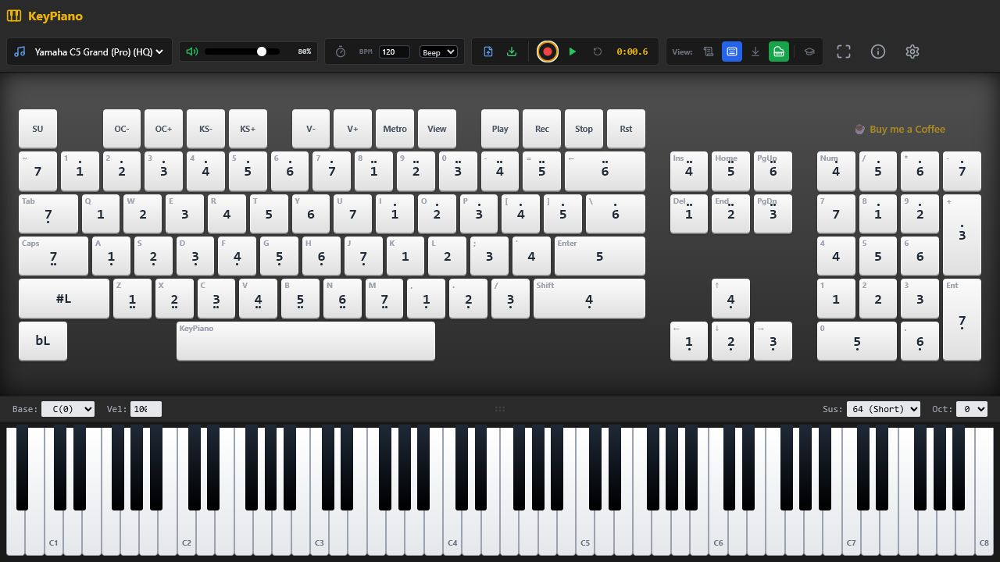

# KeyPiano

KeyPiano turns a computer keyboard or MIDI keyboard into a polyphonic browser instrument. It is inspired by [FreePiano](https://freepiano.tiwb.com/) and includes an on-screen key map, an 88-key piano, recording, MIDI import/export, practice playback, a metronome, and several sampled instruments.



[Open KeyPiano](https://keypiano.app/)

## Run locally

Requirements: Node.js 18 or newer and npm.

```bash
npm install
npm run dev
```

Useful checks:

```bash
npm run lint
npm run typecheck
npm test
npm run build
```

`npm run verify` runs lint, tests and a full build in one go — the same sequence CI runs on every push and pull request. `npm run test:watch` reruns the unit tests when source files change.

## Playing

- Samples load as soon as the page opens; your first click or keypress unlocks Web Audio, so there is no start screen to get past.
- Play with the mapped computer keys, the visual computer keyboard, the 88-key piano, or an attached MIDI keyboard.
- The visual keyboards use one Tab stop each. Use the arrow keys to move between keys, then Enter or Space to play.
- Open **Settings → MIDI keyboard → Enable MIDI** to request MIDI permission. Permission is requested only when you choose to enable it, and can be retried after denial.
- Instrument, transpose, and octave changes are locked during recording and playback so a take always uses a consistent mapping and sound.

## Keyboard shortcuts

These work anywhere on the page (the same list is in the in-app **About** dialog):

| Key | Action |
| --- | --- |
| `Esc` | Cycle sustain level (off → short → long) |
| `F1` / `F2` | Octave down / up |
| `F3` / `F4` | Transpose down / up by a semitone |
| `F5` / `F6` | Keyboard velocity down / up |
| `F7` | Toggle the metronome |
| `F8` | Switch between the stave and keyboard views |
| `F9` | Play or pause playback |
| `F10` | Start or stop recording |
| `F11` | Stop playback and reset the position |
| `F12` | Reset transpose and octave |
| `Shift` (held) | Raise left-hand notes by one semitone |
| `Ctrl` (held) | Lower left-hand notes by one semitone |
| `Space` | Play the note mapped to the spacebar |

Octave and transpose keys (`F1`–`F4`) are ignored while recording or playing back, so a take always keeps one consistent mapping.

## Recording and MIDI

Recordings store note-on and note-off events, velocity, key mapping, and transposition. MIDI import and export preserve overlapping notes of the same pitch.

MIDI files do not preserve KeyPiano-specific UI state, instrument sample names, sustain-pedal automation, or metronome settings. Imported MIDI is played with the currently selected KeyPiano instrument. KeyPiano records note events rather than microphone or rendered audio.

Track name, channel and program number from an imported file are kept and written back out, so a multi-track file survives a round trip instead of collapsing onto one channel. KeyPiano's own recordings are single-track and export on channel 1.

## Browser support

| Capability | Chromium browsers | Firefox | Safari |
| --- | --- | --- | --- |
| Computer keyboard and Web Audio | Supported | Supported | Supported |
| Installable PWA | Supported | Varies by platform | Supported on current Apple platforms |
| Web MIDI keyboard input | Supported | Not generally available | Not generally available |

Chrome or Edge is recommended when using a physical MIDI keyboard. Audio sample files are fetched from the upstream sample hosts on first use. The service worker caches successfully downloaded samples for later sessions, but a sound that has never been loaded still requires a network connection.

## Privacy

KeyPiano runs in the browser and does not upload performances. The site uses Google Analytics to count visits; nothing you play is sent to it. Selecting the coffee link or a related project opens that external site in a new tab.

## Production build

```bash
npm run build
npm run preview
```

The deploy script publishes `dist/` through `gh-pages`:

```bash
npm run deploy
```

`public/CNAME` pins the `keypiano.app` custom domain. It has to live in `public/` so Vite copies it into `dist/` — `gh-pages` replaces the branch contents on every deploy, so a `CNAME` kept only on the branch would be deleted and the domain would stop resolving.

The production build includes the web app manifest, service worker, scalable app icons, sitemap, robots file, and social preview image.

## License

MIT — see [LICENSE](LICENSE). That covers the source code only: instrument samples are fetched from third-party hosts at runtime and remain under their own licences.

## Changelog

Notable changes are listed in [CHANGELOG.md](CHANGELOG.md).
