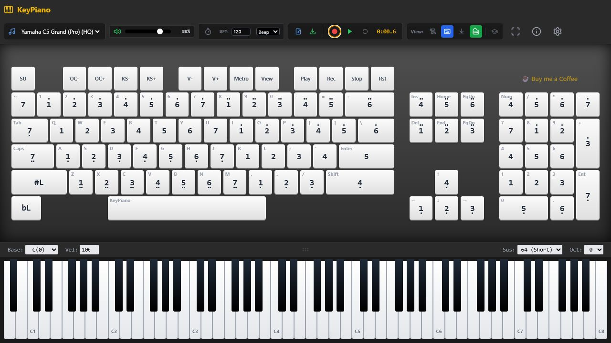

# KeyPiano

KeyPiano turns a computer keyboard or MIDI keyboard into a polyphonic browser instrument. It is inspired by [FreePiano](https://freepiano.tiwb.com/) and includes an on-screen key map, an 88-key piano, recording, MIDI import/export, practice playback, a metronome, and several sampled instruments.



[Open KeyPiano](https://keypiano.app/)

## Run locally

Requirements: Node.js 18 or newer and npm.

```bash
npm install
npm run dev
```

Useful checks:

```bash
npm run lint
npm run typecheck
npm test
npm run build
```

`npm run verify` runs lint, tests and a full build in one go — the same sequence CI runs on every push and pull request. `npm run test:watch` reruns the unit tests when source files change.

## Playing

- Samples load as soon as the page opens; your first click or keypress unlocks Web Audio, so there is no start screen to get past.
- Play with the mapped computer keys, the visual computer keyboard, the 88-key piano, or an attached MIDI keyboard.
- Organ, String Ensemble and Synth Lead keep sounding for as long as a key is held, including long notes in recording and MIDI playback. Releasing the key fades the voice using the selected sustain level (off: 30 ms; short: 0.5 s for Organ, 1 s for Strings/Lead; long or MIDI pedal down: 2 s). This release setting is separate from holding a key. Pianos, guitar and drums keep their natural decay.
- The visual keyboards use one Tab stop each. Use the arrow keys to move between keys, then Enter or Space to play.
- Open **Settings → MIDI keyboard → Enable MIDI** to request MIDI permission. Permission is requested only when you choose to enable it, and can be retried after denial.
- Instrument, transpose, and octave changes are locked during recording and playback so a take always uses a consistent mapping and sound.

## Themes

**Settings → Theme** offers Night (the default), Day and Studio, plus remade versions of the original Dark, Light, Cyber, Fauvism, Minimalist and Pastel themes. Every theme uses one colour for a key you are pressing and one for a key practice mode wants next, on the computer keyboard, the piano, the waterfall and the stave alike, and toolbar icons only take colour when they are switched on.

A theme is a palette in `theme.ts`: its values become `--kp-*` CSS variables on the page root, and every component styles itself with the shared classes that read them. Unit tests check each palette's text contrast (at least 4.5:1) and that pressed black keys and waterfall notes stand out.

## Keyboard shortcuts

These work anywhere on the page (the same list is in the in-app **About** dialog):

| Key | Action |
| --- | --- |
| `Esc` | Cycle sustain level (off → short → long) |
| `F1` / `F2` | Octave down / up |
| `F3` / `F4` | Transpose down / up by a semitone |
| `F5` / `F6` | Keyboard velocity down / up |
| `F7` | Toggle the metronome |
| `F8` | Switch between the stave and keyboard views |
| `F9` | Play or pause playback |
| `F10` | Start or stop recording |
| `F11` | Stop playback and reset the position |
| `F12` | Reset transpose and octave |
| Left `Shift` (`#L`, held) | Raise main-block notes by one semitone |
| Left `Ctrl` (`bL`, held) | Lower main-block notes by one semitone |
| `Space` | Play or pause playback in Arrange |

Octave and transpose keys (`F1`–`F4`) are ignored while recording or playing back, so a take always keeps one consistent mapping.

In Arrange, Space controls playback from the page, piano-roll grid or time ruler.
It is ignored during recording or a drag, and holding it does not repeatedly
toggle playback. Focused inputs, buttons and selectors retain their normal
Space actions; focused virtual keyboard or piano keys still play their note.
The three built-in performance maps do not assign a note to the spacebar.

## Recording and MIDI

Every recording and imported MIDI file is saved in the browser (IndexedDB) as it is made, including a snapshot every few seconds while recording, so a refresh or closed tab loses at most those few seconds. The 20 most recent appear under **Recent recordings** (the history button next to MIDI export), and the latest one is reopened when the page loads. Starting a new recording never discards the previous one. If the browser refuses storage, for example in some private modes, the panel says so and KeyPiano asks before replacing an unsaved take.

Recordings store note-on and note-off events, velocity, key mapping, and transposition. MIDI import and export preserve overlapping notes of the same pitch.

Held notes have no fixed duration limit: their length is the time between note-on and note-off. Sustained instruments use the same events for live input, scheduled playback and piano-roll editing.

MIDI files do not preserve KeyPiano-specific UI state, instrument sample names, sustain-pedal automation, or metronome settings. Imported MIDI is played with the currently selected KeyPiano instrument. KeyPiano records note events rather than microphone or rendered audio.

Track name, channel and program number from an imported file are kept and written back out, so a multi-track file survives a round trip instead of collapsing onto one channel. KeyPiano's own recordings normally export as one track on channel 1; nested same-pitch notes may use extra channels to preserve their lengths.

## Arrange view

Choose **Arrange** in the view controls to open the horizontal piano roll. The
bottom virtual piano starts hidden; its toolbar toggle can show it, and this
choice is independent of other views. With
**Auto record** enabled (the default), the first computer-keyboard, on-screen
piano or MIDI note starts recording immediately. Held notes grow into bars;
new performances append at the end of the current piece. Choose **Continuous**
to retain the pauses between notes, or **While keys are held** to pause the
musical clock whenever all computer/on-screen/MIDI keys are released. The
latter keeps real held durations and overlapping chords, while omitting idle
gaps between phrases; its paused state continues the same locally saved take.
Use **Stop recording**
or `F10` to finish, then edit. Recording and playback lock editing.

- Click an empty cell to add a note. Drag a note to change its onset and pitch;
  drag its right edge to change its length.
- Right-click a note to delete that note directly, with undo. Right-dragging
  from a note selects a region instead; cancelling a drag never deletes it.
- Right-drag a region to select every note bar touching it. Shift+right-drag
  adds to the selection, Shift+click toggles individual notes, and Ctrl/Cmd+A
  selects all. Selected notes move together when you drag any one of them;
  dragging a right edge changes all selected lengths by the same amount.
- Press Delete/Backspace or the trash button to remove selected notes.
  Arrow keys move the group; Shift+Left/Right changes its lengths. Group edits
  preserve relative timing and pitch, and stop at the timeline/pitch boundaries.
  Escape cancels a drag or clears the selection. Each group edit is one undo step.
- Undo/Redo buttons and Ctrl/Cmd+Z, Ctrl/Cmd+Shift+Z or Ctrl+Y retain up to 100
  edits in the current editing session. Importing, recording or refreshing
  starts a new undo history.
- Choose free timing or 1/4–1/32 snapping and zoom the time and pitch axes
  independently. Pitch zoom keeps the visible pitch centre in place; **Fit notes**
  shows the arrangement's full pitch range. Scroll to other pitches or measures.
  At small row heights, octave labels remain visible and note details are
  available on hover. Recorded timing stays intact until an edit snaps it.
- Play to audition, then download the edited piece with MIDI export. Existing
  recordings and imported MIDI can be edited in the same view.
- Click or drag the time ruler or playhead to choose the playback position.
  A drag previews its position and applies it on release; playback resumes at
  the chosen time if it was already running. Escape cancels the drag. With the
  ruler focused, arrow keys adjust the position, Shift+arrows move a measure,
  and Home/End jump to the beginning/end. Seeking is disabled during recording.

Edits are saved locally as a separate take so the original remains in **Recent
recordings**. The ruler uses 4/4 and the toolbar BPM; changing BPM changes the
grid and exported tempo without stretching existing note times. MIDI export
keeps track names, programs and channels. Nested same-pitch notes can require
an extra MIDI channel to preserve their individual durations; if no channel is
available, export reports this instead of changing their lengths.

## Practice mode

Load a recording or MIDI file, turn on practice mode (graduation-cap button), then press Play. Playback is silent. Keys fill in with colour as their notes approach, like the notes falling in the waterfall view; a fully lit key means play it now. With **wait mode** (hourglass button, on by default) playback stops at each note or chord until you have pressed all of its notes (only the ones still to press stay fully lit), on any input: computer keyboard, on-screen keys or a MIDI keyboard. Notes are matched by pitch, so transposition does not matter. **Skip** moves past notes you cannot reach. Turn wait mode off to play along at a fixed tempo, optionally slowed down with the speed control.

Pieces you recorded on the computer keyboard light the exact keys you pressed. Imported MIDI is planned in the background before practice playback starts. The full-size default prefers unmodified notes on the numpad/navigation keys and altered notes on the main block with left Shift (`#L`) or left Ctrl (`bL`). For example, D–F#–A uses numpad 2 and 6 with Shift+R in the FreePiano map. The planner keeps several possible paths through the piece, considering note durations, occupied keys/fingers, chord span, modifier reach, movement speed, hand changes and modifier switches. It can keep a chromatic melody on the main block when that avoids repeatedly changing hands.

Practice keys show the recommended hand and finger: **L/R** means left/right, and **1–5** means thumb, index, middle, ring and little finger. **•** after the finger number means keep holding until the cue ends. A held modifier uses the left little finger. If the original score cannot fit, the coach reports the adaptation. In wait mode, a chord requiring separate presses lights only its current step fully and advances to the next step after those pitches are played. A required early release names the key to release. Held notes retain their original note labels rather than asking you to hold an old modifier throughout the note.

These are recommended fingerings under a conservative computer-keyboard model. The search is bounded for responsiveness, and its hand-span rules and cost weights are not calibrated to each person's hands or validated as expert fingerings. It does not claim a universal or mathematically proven optimum. The scoring model and search limits are documented in [Fingering planner](docs/fingering-planner.md).

Turn off **Settings → My keyboard has a numpad** for a compact keyboard. Hands then prefer the lower and upper main rows (by track when possible); chords that cannot share one modifier need separate presses. A full-size keyboard can also require adaptations when reach or finger occupancy prevents the original score. This update resets the earlier numpad-hint preference to the full-size default once; subsequent choices are remembered. When notes fall outside the keys' range, practice mode suggests an octave that fits more of them.

## Browser support

| Capability | Chromium browsers | Firefox | Safari |
| --- | --- | --- | --- |
| Computer keyboard and Web Audio | Supported | Supported | Supported |
| Installable PWA | Supported | Varies by platform | Supported on current Apple platforms |
| Web MIDI keyboard input | Supported | Not generally available | Not generally available |

Chrome or Edge is recommended when using a physical MIDI keyboard. Audio sample files are fetched on first use from the server chosen in **Settings → Sample server**: the upstream GitHub hosts by default, or a jsDelivr mirror (Fastly or Gcore) of the same files, pinned to a fixed commit. If sounds stay silent or load slowly, as can happen from mainland China, switch servers there. The service worker caches successfully downloaded samples for later sessions, but a sound that has never been loaded still requires a network connection.

## Privacy

KeyPiano runs in the browser and does not upload performances. The site uses Google Analytics to count visits and to record which sample server is chosen and how long its samples take to load (`sample_source_change` and `sample_load` events); nothing you play is sent to it. Selecting the coffee link or a related project opens that external site in a new tab.

## Production build

```bash
npm run build
npm run preview
```

The deploy script publishes `dist/` through `gh-pages`:

```bash
npm run deploy
```

`public/CNAME` pins the `keypiano.app` custom domain. It has to live in `public/` so Vite copies it into `dist/` — `gh-pages` replaces the branch contents on every deploy, so a `CNAME` kept only on the branch would be deleted and the domain would stop resolving.

The production build includes the web app manifest, service worker, scalable app icons, sitemap, robots file, and social preview image.

## License

MIT — see [LICENSE](LICENSE). That covers the source code only: instrument samples are fetched from third-party hosts at runtime and remain under their own licences.

## Changelog

Notable changes are listed in [CHANGELOG.md](CHANGELOG.md).
